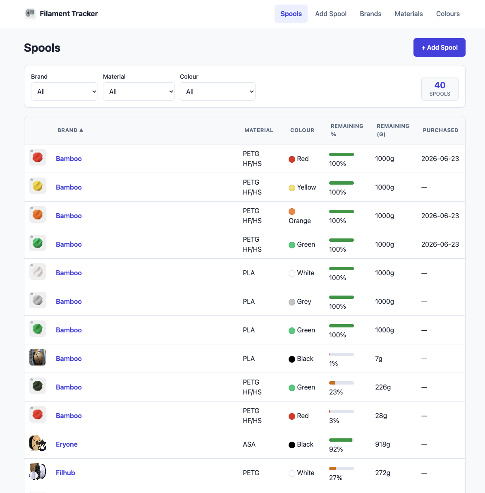
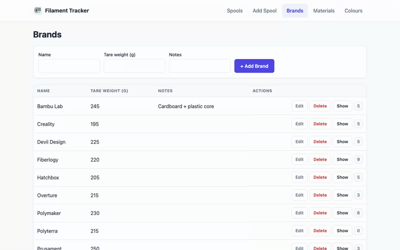

# filamentTracker
Track 3d printer filaments stock

## What it does

It's a self-hosted inventory tracker for 3D printing filament. Instead of digging through boxes to remember what spools you have and how much is left, you get one list: brand, material, colour, a photo, and roughly how much filament remains — worked out from weight, not guesswork.

**If you've got more than a handful of spools, this is for you.** Once you're past ~10 spools it gets genuinely hard to remember what's half-empty, what's almost done, and what you need to reorder. This app is built for that: filter by brand/material/colour, sort by how much is left, and see at a glance what's running low.

## What you can do

- **Add a spool** in a short wizard: pick brand/material/colour, weigh it (new or already-opened), snap a photo, paste the product link(s).
- **Track remaining filament** — log a new weight anytime (spool + filament, straight from a kitchen scale) and it recalculates % and grams left automatically.
- **Filter and sort** the spool list by brand, material, colour, or remaining stock.
- **See usage at a glance** on the Brands/Materials/Colours pages — each entry shows how many spools use it, with a one-click "Show" to jump to those spools.
- **Clone** a spool when you buy a duplicate, so you don't re-enter everything from scratch.
- **Edit or delete** any spool later if you got something wrong or used it up.

Works just as well on your phone as on a desktop — the whole UI is mobile-optimized, so you can pull it up and weigh a spool standing at the printer.
Cool thing is (at least on Adroid for sure) that adding picture opens camera app and you can take a photo of the spool and it will be attached just like that! 

## Running it

Two ways to run it, same app either way:

- **Locally**, for development: `cargo run` (needs Rust + SQLite; see `SPEC.md` for the full dev setup).
- **Deployed with Docker**: `docker compose up --build` — single container, single image, no extra services needed.

## How to use it

1. First, add at least one **Brand**, **Material**, and **Colour** (their own tabs) — these are the building blocks for spools. Brands also store the empty-spool weight, since that's how remaining filament gets calculated.
2. Go to **Add Spool**, fill in the wizard, and save.
3. Whenever you weigh a spool again (e.g. after a print), open it and log the new weight — no need to redo the math yourself.
4. Use the **Spools** list to filter/sort and see what's running low.

No accounts, no cloud — it's just you, self-hosted, with your own filament data.

